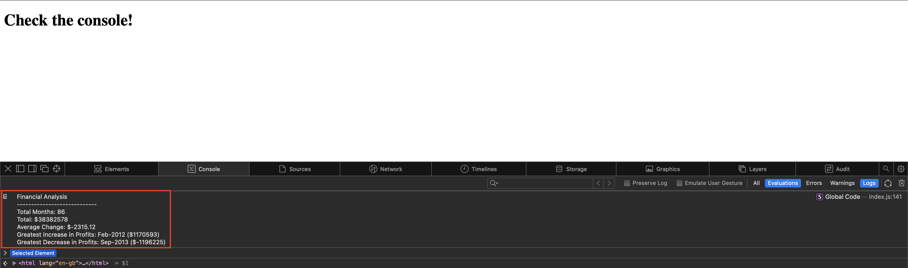

# Console-Finances

## **Description**
This program takes in an array of data and uses it to calculate the following:
- Total Months
- Total
- Average Change
- Greatest Increase in Profits
- Greatest Decrease in Profits

This is an example of an output you might expect:

Deployed code: https://adrian-kosnik.github.io/Console-Finances/

---

## **Installation**
N/A

---

## **Licence**
UNLICENSED

---

### **This project is built using:**
\
 
